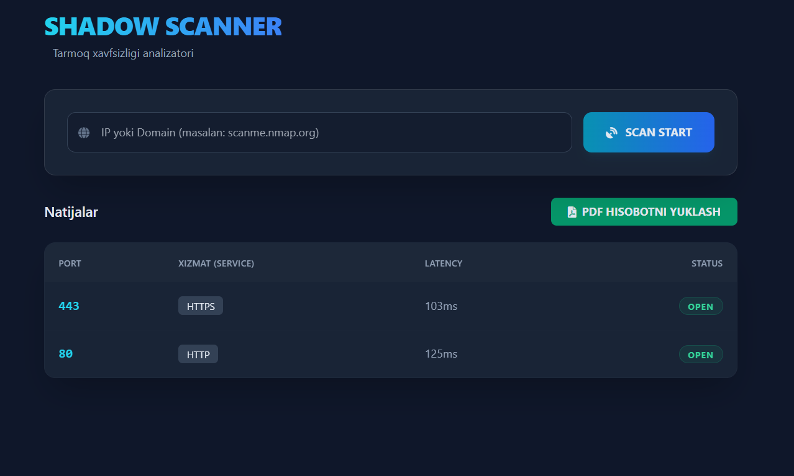

# 🚀 ShadowScanner: High-Performance Network Analyzer

ShadowScanner — bu Go (Golang) tilida yozilgan, parallelizm (concurrency) imkoniyatlaridan foydalanuvchi professional tarmoq skaneri. U real vaqt rejimida (Live) portlarni tekshiradi va natijalarni PDF ko'rinishida taqdim etadi.



## ✨ Asosiy Xususiyatlar

- **Extreme Speed:** Go'ning `goroutines` va `worker pool` texnologiyasi orqali minglab portlarni bir necha soniyada skanerlash.
- **Real-time Dashboard:** WebSocket yordamida natijalarni brauzerda kutib o'tirmasdan, jonli efirda ko'rish.
- **Service Detection:** Ochiq portlarda qanday xizmatlar (HTTP, SSH, MySQL va h.k.) ishlayotganini avtomatik aniqlash.
- **PDF Reporting:** Skanerlash yakunlangandan so'ng professional PDF hisobot yaratish.
- **Modern UI:** Tailwind CSS yordamida yaratilgan "Glassmorphism" uslubidagi dashboard.

## 📁 Loyiha Strukturasi

```text
SHADOW-SCANNER-GO/
├── cmd/                # Dasturni ishga tushirish (main.go)
├── internal/           # Loyihaning asosiy mantiqi
│   ├── models/         # Ma'lumotlar turlari (result.go)
│   ├── scanner/        # Skanerlash va PDF yaratish (engine, worker, report)
│   └── ws/             # WebSocket Hub (hub.go)
├── static/             # Frontend fayllari (index.html)
├── photo.png           # Loyiha ko'rinishi (Screenshot)
├── report.pdf          # Generatsiya qilingan hisobot
└── go.mod              # Loyiha bog'liqliklari